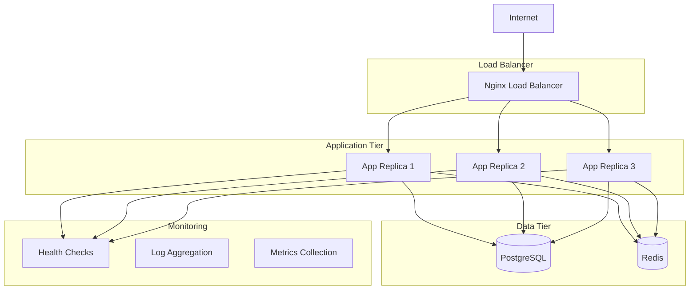

# Deployment Guide

This guide provides comprehensive instructions for deploying the Cake System in various environments, from local development to production-ready deployments.

## Table of Contents

1. [Quick Start](#quick-start)
2. [Local Development](#local-development)
3. [Production Deployment](#production-deployment)
4. [Environment Configuration](#environment-configuration)
5. [Database Setup](#database-setup)
6. [Monitoring Setup](#monitoring-setup)
7. [SSL/TLS Configuration](#ssltls-configuration)
8. [Backup & Recovery](#backup--recovery)
9. [Troubleshooting](#troubleshooting)
10. [Maintenance](#maintenance)

## Quick Start

### Using Docker Compose (Recommended)

1. **Clone the repository**:
   ```bash
   git clone <repository-url>
   cd cake-system
   ```

2. **Start all services**:
   ```bash
   docker-compose up -d
   ```

3. **Verify deployment**:
   ```bash
   # Check health status
   curl http://localhost:3000/health
   
   # Check all services are running
   docker-compose ps
   ```

4. **View logs**:
   ```bash
   # Application logs
   docker-compose logs -f app
   
   # All services logs
   docker-compose logs -f
   ```

### Service URLs

- **Application**: http://localhost:3000
- **Health Check**: http://localhost:3000/health
- **Database**: localhost:5432
- **Redis Cache**: localhost:6379

## Local Development

### Prerequisites

- **Node.js**: 20.x or higher
- **pnpm**: 8.x or higher
- **Docker**: 24.x or higher
- **Docker Compose**: 2.x or higher

### Setup Steps

1. **Install dependencies**:
   ```bash
   pnpm install
   ```

2. **Environment configuration**:
   ```bash
   cp env.template .env
   ```

3. **Start infrastructure services**:
   ```bash
   docker-compose up -d postgres redis
   ```

4. **Run database migrations**:
   ```bash
   pnpm run migration:run
   ```

5. **Start the application**:
   ```bash
   # Development mode with hot reload
   pnpm run start:dev
   
   # Debug mode
   pnpm run start:debug
   ```

### Development Environment Variables

```bash
# .env for local development
NODE_ENV=development
PORT=3000
DEBUG=true
LOG_LEVEL=debug

# Database (using Docker services)
POSTGRES_HOST=localhost
POSTGRES_PORT=5432
POSTGRES_USER=postgres
POSTGRES_PASSWORD=password
POSTGRES_DATABASE=cake_system
POSTGRES_SSL=false

# JWT Configuration
JWT_SECRET=development-jwt-secret-change-in-production
JWT_EXPIRES_IN=7d

# Redis Cache
REDIS_URL=redis://localhost:6379/0

# OpenTelemetry (optional for development)
OTEL_EXPORTER_OTLP_GRPC_ENDPOINT=http://localhost:4317
```

### Development Commands

```bash
# Install dependencies
pnpm install

# Start development server
pnpm run start:dev

# Run tests
pnpm run test
pnpm run test:e2e

# Database operations
pnpm run migration:generate
pnpm run migration:run
pnpm run migration:revert

# Code quality
pnpm run lint
pnpm run format

# Build for production
pnpm run build
```

## Production Deployment

### Architecture Overview



### Production Docker Compose

```yaml
# docker-compose.prod.yml
version: '3.8'

services:
  # PostgreSQL Database
  postgres:
    image: postgres:16-alpine
    container_name: cake-system-postgres
    restart: unless-stopped
    environment:
      POSTGRES_USER: ${POSTGRES_USER}
      POSTGRES_PASSWORD: ${POSTGRES_PASSWORD}
      POSTGRES_DB: ${POSTGRES_DATABASE}
      PGDATA: /var/lib/postgresql/data/pgdata
    ports:
      - "5432:5432"
    volumes:
      - postgres_data:/var/lib/postgresql/data
      - ./postgresql.conf:/etc/postgresql/postgresql.conf
    command: postgres -c config_file=/etc/postgresql/postgresql.conf
    networks:
      - cake-network
    healthcheck:
      test: ["CMD-SHELL", "pg_isready -U ${POSTGRES_USER}"]
      interval: 10s
      timeout: 5s
      retries: 5

  # Redis Cache
  redis:
    image: redis:7-alpine
    container_name: cake-system-redis
    restart: unless-stopped
    command: redis-server --appendonly yes --maxmemory 1gb --maxmemory-policy allkeys-lru
    ports:
      - "6379:6379"
    volumes:
      - redis_data:/data
      - ./redis.conf:/etc/redis/redis.conf
    networks:
      - cake-network
    healthcheck:
      test: ["CMD", "redis-cli", "ping"]
      interval: 10s
      timeout: 5s
      retries: 5

  # NestJS Application
  app:
    build:
      context: .
      dockerfile: Dockerfile
      target: production
    restart: unless-stopped
    expose:
      - "3000"
    environment:
      NODE_ENV: production
      PORT: 3000
      DEBUG: false
      LOG_LEVEL: info
      POSTGRES_HOST: postgres
      POSTGRES_PORT: 5432
      POSTGRES_USER: ${POSTGRES_USER}
      POSTGRES_PASSWORD: ${POSTGRES_PASSWORD}
      POSTGRES_DATABASE: ${POSTGRES_DATABASE}
      POSTGRES_SSL: false
      JWT_SECRET: ${JWT_SECRET}
      JWT_EXPIRES_IN: ${JWT_EXPIRES_IN}
      REDIS_URL: redis://redis:6379/0
      OTEL_EXPORTER_OTLP_GRPC_ENDPOINT: ${OTEL_EXPORTER_OTLP_GRPC_ENDPOINT}
    command: sh -c 'npm run typeorm -- -d dist/config/typeorm.config.js migration:run && node --require ./dist/instrumentation.js dist/main'
    networks:
      - cake-network
    depends_on:
      postgres:
        condition: service_healthy
      redis:
        condition: service_healthy
    healthcheck:
      test: ["CMD-SHELL", "wget --no-verbose --tries=1 -O- http://localhost:3000/health > /dev/null || exit 1"]
      interval: 30s
      timeout: 10s
      retries: 3
      start_period: 40s
    deploy:
      replicas: 3
      resources:
        limits:
          cpus: '2.0'
          memory: 2G
        reservations:
          cpus: '1.0'
          memory: 1G

  # Load Balancer
  nginx:
    image: nginx:alpine
    container_name: cake-system-nginx
    restart: unless-stopped
    ports:
      - "80:80"
      - "443:443"
    volumes:
      - ./nginx/nginx.prod.conf:/etc/nginx/nginx.conf:ro
      - ./ssl:/etc/nginx/ssl:ro
    depends_on:
      - app
    networks:
      - cake-network
    healthcheck:
      test: ["CMD", "wget", "--no-verbose", "--tries=1", "-O-", "http://localhost/health"]
      interval: 30s
      timeout: 10s
      retries: 3

volumes:
  postgres_data:
    driver: local
  redis_data:
    driver: local

networks:
  cake-network:
    driver: bridge
```

### Production Environment Variables

Create a `.env.production` file:

```bash
# Application Configuration
NODE_ENV=production
PORT=3000
DEBUG=false
LOG_LEVEL=info

# Database Configuration
POSTGRES_HOST=postgres
POSTGRES_PORT=5432
POSTGRES_USER=postgres
POSTGRES_PASSWORD=your-super-secure-database-password-change-this
POSTGRES_DATABASE=cake_system
POSTGRES_SSL=false

# JWT Configuration
JWT_SECRET=your-super-secret-jwt-key-minimum-32-characters-change-this-in-production
JWT_EXPIRES_IN=7d

# Cache Configuration
REDIS_URL=redis://redis:6379/0

# Monitoring Configuration
OTEL_EXPORTER_OTLP_GRPC_ENDPOINT=http://otel-collector:4317

# Security Configuration
CORS_ORIGIN=https://your-frontend-domain.com
RATE_LIMIT_TTL=60000
RATE_LIMIT_MAX=100
```

### Deployment Commands

```bash
# Build production images
docker-compose -f docker-compose.prod.yml build

# Start production environment
docker-compose -f docker-compose.prod.yml up -d

# View production logs
docker-compose -f docker-compose.prod.yml logs -f

# Scale application replicas
docker-compose -f docker-compose.prod.yml up -d --scale app=5

# Stop production environment
docker-compose -f docker-compose.prod.yml down

# Clean up (removes volumes)
docker-compose -f docker-compose.prod.yml down -v
```

## Environment Configuration

### Environment Variables Reference

| Variable | Description | Default | Required |
|----------|-------------|---------|----------|
| `NODE_ENV` | Application environment | `development` | ✅ |
| `PORT` | Application port | `3000` | ✅ |
| `DEBUG` | Enable debug mode | `false` | ❌ |
| `LOG_LEVEL` | Logging level | `info` | ❌ |
| `POSTGRES_HOST` | Database host | `localhost` | ✅ |
| `POSTGRES_PORT` | Database port | `5432` | ✅ |
| `POSTGRES_USER` | Database user | `postgres` | ✅ |
| `POSTGRES_PASSWORD` | Database password | - | ✅ |
| `POSTGRES_DATABASE` | Database name | `cake_system` | ✅ |
| `POSTGRES_SSL` | Enable SSL | `false` | ❌ |
| `JWT_SECRET` | JWT signing secret | - | ✅ |
| `JWT_EXPIRES_IN` | JWT expiration | `7d` | ❌ |
| `REDIS_URL` | Redis connection URL | `redis://localhost:6379/0` | ✅ |
| `OTEL_EXPORTER_OTLP_GRPC_ENDPOINT` | OpenTelemetry endpoint | - | ❌ |

### Security Considerations

#### JWT Secret Generation
```bash
# Generate a secure JWT secret (minimum 32 characters)
openssl rand -hex 32

# Example output:
# a1b2c3d4e5f6789012345678901234567890abcdef1234567890abcdef123456
```

#### Database Password
```bash
# Generate a secure database password
openssl rand -base64 32

# Example output:
# K8mN9pQ2rS3tU4vW5xY6zA7bC8dE9fG0hI1jK2lM3nO=
```

### Configuration Validation

The application validates environment variables on startup:

```typescript
// src/config/config.service.ts
import { cleanEnv, str, num, bool } from 'envalid';

const config = cleanEnv(process.env, {
  NODE_ENV: str({ choices: ['development', 'production', 'test'] }),
  PORT: num({ default: 3000 }),
  DEBUG: bool({ default: false }),
  LOG_LEVEL: str({ choices: ['error', 'warn', 'info', 'debug'], default: 'info' }),
  
  // Database
  POSTGRES_HOST: str(),
  POSTGRES_PORT: num({ default: 5432 }),
  POSTGRES_USER: str(),
  POSTGRES_PASSWORD: str(),
  POSTGRES_DATABASE: str(),
  POSTGRES_SSL: bool({ default: false }),
  
  // JWT
  JWT_SECRET: str({ minLength: 32 }),
  JWT_EXPIRES_IN: str({ default: '7d' }),
  
  // Redis
  REDIS_URL: str(),
  
  // OpenTelemetry (optional)
  OTEL_EXPORTER_OTLP_GRPC_ENDPOINT: str({ default: '' }),
});

export default config;
```

## Database Setup

### PostgreSQL Configuration

#### Production PostgreSQL Configuration (`postgresql.conf`)

```ini
# postgresql.conf for production
# Memory Configuration
shared_buffers = 256MB
effective_cache_size = 1GB
work_mem = 4MB
maintenance_work_mem = 64MB

# Connection Configuration
max_connections = 200
superuser_reserved_connections = 3

# Logging Configuration
log_destination = 'stderr'
logging_collector = on
log_directory = 'pg_log'
log_filename = 'postgresql-%Y-%m-%d_%H%M%S.log'
log_truncate_on_rotation = on
log_rotation_age = 1d
log_rotation_size = 10MB
log_min_duration_statement = 1000
log_line_prefix = '%t [%p]: [%l-1] user=%u,db=%d,app=%a,client=%h '
log_checkpoints = on
log_connections = on
log_disconnections = on
log_lock_waits = on

# Performance Configuration
checkpoint_timeout = 10min
checkpoint_completion_target = 0.9
wal_buffers = 16MB
default_statistics_target = 100

# Security Configuration
ssl = off  # Enable if using SSL certificates
```

#### Database Initialization

```bash
# Run migrations
docker-compose exec app npm run typeorm -- -d dist/config/typeorm.config.js migration:run

# Check migration status
docker-compose exec app npm run typeorm -- -d dist/config/typeorm.config.js migration:show

# Create new migration
docker-compose exec app npm run migration:generate -- src/migrations/NewMigration
```

#### Database Backup

```bash
# Create backup
docker exec cake-system-postgres pg_dump -U postgres -d cake_system > backup_$(date +%Y%m%d_%H%M%S).sql

# Restore from backup
docker exec -i cake-system-postgres psql -U postgres -d cake_system < backup_20240115_120000.sql

# Automated backup script
#!/bin/bash
BACKUP_DIR="/backups"
TIMESTAMP=$(date +%Y%m%d_%H%M%S)
BACKUP_FILE="$BACKUP_DIR/cake_system_$TIMESTAMP.sql"

docker exec cake-system-postgres pg_dump -U postgres -d cake_system > "$BACKUP_FILE"
gzip "$BACKUP_FILE"

# Keep only last 7 days of backups
find "$BACKUP_DIR" -name "cake_system_*.sql.gz" -mtime +7 -delete
```

### Redis Configuration

#### Production Redis Configuration (`redis.conf`)

```ini
# redis.conf for production
# Memory Configuration
maxmemory 1gb
maxmemory-policy allkeys-lru

# Persistence Configuration
save 900 1
save 300 10
save 60 10000

# Append Only File
appendonly yes
appendfsync everysec

# Security Configuration
# requirepass your-redis-password  # Uncomment and set password

# Network Configuration
bind 127.0.0.1 ::1
port 6379
timeout 300
keepalive 60

# Logging Configuration
loglevel notice
logfile /var/log/redis/redis.log

# Performance Configuration
tcp-backlog 511
databases 16
```

## Monitoring Setup

### Health Checks

The application provides comprehensive health checks:

```bash
# Basic health check
curl http://localhost:3000/health

# Expected response
{
  "status": "healthy",
  "timestamp": "2024-01-15T10:30:00.000Z",
  "uptime": 3600,
  "responseTime": 15,
  "checks": {
    "database": "healthy",
    "memory": "healthy",
    "cache": "healthy"
  },
  "memory": {
    "used": 512,
    "total": 1024,
    "external": 128
  }
}
```

### Docker Health Checks

Health checks are configured in Docker Compose:

```yaml
healthcheck:
  test: ["CMD-SHELL", "wget --no-verbose --tries=1 -O- http://localhost:3000/health > /dev/null || exit 1"]
  interval: 30s
  timeout: 10s
  retries: 3
  start_period: 40s
```

### OpenTelemetry Monitoring

#### Basic Monitoring Stack

```yaml
# docker-compose.monitoring.yml
version: '3.8'

services:
  # OpenTelemetry Collector
  otel-collector:
    image: otel/opentelemetry-collector:latest
    command: ["--config=/etc/otel-collector-config.yml"]
    volumes:
      - ./otel-collector-config.yml:/etc/otel-collector-config.yml
    ports:
      - "4317:4317"   # OTLP gRPC receiver
      - "4318:4318"   # OTLP HTTP receiver
    networks:
      - monitoring

  # Jaeger for distributed tracing
  jaeger:
    image: jaegertracing/all-in-one:latest
    ports:
      - "16686:16686"  # Jaeger UI
      - "14250:14250"  # gRPC
    environment:
      - COLLECTOR_OTLP_ENABLED=true
    networks:
      - monitoring

  # Prometheus for metrics
  prometheus:
    image: prom/prometheus:latest
    ports:
      - "9090:9090"
    volumes:
      - ./prometheus.yml:/etc/prometheus/prometheus.yml
    networks:
      - monitoring

  # Grafana for dashboards
  grafana:
    image: grafana/grafana:latest
    ports:
      - "3001:3000"
    environment:
      - GF_SECURITY_ADMIN_PASSWORD=admin
    volumes:
      - grafana_data:/var/lib/grafana
    networks:
      - monitoring

volumes:
  grafana_data:

networks:
  monitoring:
    driver: bridge
```

#### OpenTelemetry Collector Configuration

```yaml
# otel-collector-config.yml
receivers:
  otlp:
    protocols:
      grpc:
        endpoint: 0.0.0.0:4317
      http:
        endpoint: 0.0.0.0:4318

processors:
  batch:

exporters:
  jaeger:
    endpoint: jaeger:14250
    tls:
      insecure: true
  prometheus:
    endpoint: "0.0.0.0:8889"

service:
  pipelines:
    traces:
      receivers: [otlp]
      processors: [batch]
      exporters: [jaeger]
    metrics:
      receivers: [otlp]
      processors: [batch]
      exporters: [prometheus]
```

## SSL/TLS Configuration

### Nginx SSL Configuration

```nginx
# nginx/nginx.ssl.conf
events {
    worker_connections 1024;
}

http {
    upstream backend_app {
        server app:3000 max_fails=3 fail_timeout=30s;
        least_conn;
        keepalive 32;
    }

    # Redirect HTTP to HTTPS
    server {
        listen 80;
        server_name your-domain.com;
        return 301 https://$server_name$request_uri;
    }

    # HTTPS server
    server {
        listen 443 ssl http2;
        server_name your-domain.com;

        # SSL Configuration
        ssl_certificate /etc/nginx/ssl/cert.pem;
        ssl_certificate_key /etc/nginx/ssl/key.pem;
        ssl_session_timeout 1d;
        ssl_session_cache shared:SSL:50m;
        ssl_session_tickets off;

        # Modern SSL configuration
        ssl_protocols TLSv1.2 TLSv1.3;
        ssl_ciphers ECDHE-ECDSA-AES128-GCM-SHA256:ECDHE-RSA-AES128-GCM-SHA256:ECDHE-ECDSA-AES256-GCM-SHA384:ECDHE-RSA-AES256-GCM-SHA384;
        ssl_prefer_server_ciphers off;

        # HSTS
        add_header Strict-Transport-Security "max-age=63072000" always;

        # Security headers
        add_header X-Frame-Options DENY;
        add_header X-Content-Type-Options nosniff;
        add_header X-XSS-Protection "1; mode=block";

        location / {
            proxy_pass http://backend_app;
            proxy_http_version 1.1;
            proxy_set_header Upgrade $http_upgrade;
            proxy_set_header Connection 'upgrade';
            proxy_set_header Host $host;
            proxy_set_header X-Real-IP $remote_addr;
            proxy_set_header X-Forwarded-For $proxy_add_x_forwarded_for;
            proxy_set_header X-Forwarded-Proto $scheme;
            proxy_cache_bypass $http_upgrade;
        }
    }
}
```

### SSL Certificate Setup

#### Using Let's Encrypt (Certbot)

```bash
# Install certbot
sudo apt-get update
sudo apt-get install certbot python3-certbot-nginx

# Generate certificate
sudo certbot --nginx -d your-domain.com

# Auto-renewal setup
sudo crontab -e
# Add: 0 12 * * * /usr/bin/certbot renew --quiet
```

#### Using Self-Signed Certificates (Development)

```bash
# Generate self-signed certificate
openssl req -x509 -nodes -days 365 -newkey rsa:2048 \
  -keyout ssl/key.pem \
  -out ssl/cert.pem \
  -subj "/C=US/ST=State/L=City/O=Organization/CN=localhost"
```

## Backup & Recovery

### Automated Backup Script

```bash
#!/bin/bash
# backup.sh - Automated backup script

set -e

BACKUP_DIR="/backups"
TIMESTAMP=$(date +%Y%m%d_%H%M%S)
RETENTION_DAYS=7

# Create backup directory
mkdir -p "$BACKUP_DIR"

# Database backup
echo "Creating database backup..."
docker exec cake-system-postgres pg_dump -U postgres -d cake_system > "$BACKUP_DIR/database_$TIMESTAMP.sql"
gzip "$BACKUP_DIR/database_$TIMESTAMP.sql"

# Redis backup
echo "Creating Redis backup..."
docker exec cake-system-redis redis-cli BGSAVE
docker cp cake-system-redis:/data/dump.rdb "$BACKUP_DIR/redis_$TIMESTAMP.rdb"
gzip "$BACKUP_DIR/redis_$TIMESTAMP.rdb"

# Application configuration backup
echo "Creating configuration backup..."
tar -czf "$BACKUP_DIR/config_$TIMESTAMP.tar.gz" \
  .env \
  docker-compose.yml \
  nginx/ \
  ssl/

# Clean old backups
echo "Cleaning old backups..."
find "$BACKUP_DIR" -name "*.gz" -mtime +$RETENTION_DAYS -delete
find "$BACKUP_DIR" -name "*.tar.gz" -mtime +$RETENTION_DAYS -delete

echo "Backup completed: $TIMESTAMP"
```

### Recovery Procedures

#### Database Recovery

```bash
# Stop application
docker-compose stop app

# Restore database
gunzip -c backup_database_20240115_120000.sql.gz | \
  docker exec -i cake-system-postgres psql -U postgres -d cake_system

# Start application
docker-compose start app
```

#### Redis Recovery

```bash
# Stop Redis
docker-compose stop redis

# Restore Redis data
gunzip -c backup_redis_20240115_120000.rdb.gz > dump.rdb
docker cp dump.rdb cake-system-redis:/data/dump.rdb

# Start Redis
docker-compose start redis
```

#### Complete System Recovery

```bash
# 1. Restore configuration
tar -xzf backup_config_20240115_120000.tar.gz

# 2. Start infrastructure
docker-compose up -d postgres redis

# 3. Restore database
gunzip -c backup_database_20240115_120000.sql.gz | \
  docker exec -i cake-system-postgres psql -U postgres -d cake_system

# 4. Restore Redis
gunzip -c backup_redis_20240115_120000.rdb.gz > dump.rdb
docker cp dump.rdb cake-system-redis:/data/dump.rdb
docker-compose restart redis

# 5. Start application
docker-compose up -d app nginx
```

## Troubleshooting

### Common Issues

#### 1. Application Won't Start

```bash
# Check logs
docker-compose logs app

# Common causes:
# - Database connection failed
# - Missing environment variables
# - Port already in use
# - Insufficient resources

# Solutions:
# Check database is running
docker-compose ps postgres

# Verify environment variables
docker-compose config

# Check port usage
netstat -tulpn | grep :3000
```

#### 2. Database Connection Issues

```bash
# Test database connectivity
docker exec cake-system-postgres pg_isready -U postgres

# Check database logs
docker-compose logs postgres

# Connect to database manually
docker exec -it cake-system-postgres psql -U postgres -d cake_system

# Check connection pool
docker exec -it cake-system-postgres psql -U postgres -c "SELECT count(*) FROM pg_stat_activity;"
```

#### 3. High Memory Usage

```bash
# Monitor container resources
docker stats

# Check memory usage by service
docker exec cake-system-app node -e "console.log(process.memoryUsage())"

# Solutions:
# - Increase container memory limits
# - Optimize application queries
# - Enable garbage collection logging
# - Check for memory leaks
```

#### 4. Performance Issues

```bash
# Check response times
curl -w "@curl-format.txt" -o /dev/null -s http://localhost:3000/health

# curl-format.txt content:
#     time_namelookup:  %{time_namelookup}\n
#        time_connect:  %{time_connect}\n
#     time_appconnect:  %{time_appconnect}\n
#    time_pretransfer:  %{time_pretransfer}\n
#       time_redirect:  %{time_redirect}\n
#  time_starttransfer:  %{time_starttransfer}\n
#                     ----------\n
#          time_total:  %{time_total}\n

# Check database performance
docker exec cake-system-postgres psql -U postgres -c "
  SELECT query, mean_time, calls 
  FROM pg_stat_statements 
  ORDER BY mean_time DESC 
  LIMIT 10;"
```

### Debugging Commands

```bash
# Application debugging
docker-compose exec app npm run start:debug

# Database debugging
docker exec -it cake-system-postgres psql -U postgres -d cake_system
\dt  -- List tables
\d users  -- Describe users table

# Redis debugging
docker exec -it cake-system-redis redis-cli
INFO memory  -- Memory usage
KEYS *  -- List all keys

# Network debugging
docker network ls
docker network inspect cake-system_cake-network

# Container debugging
docker exec -it cake-system-app /bin/sh
ps aux  -- List processes
netstat -tulpn  -- List ports
```

## Maintenance

### Regular Maintenance Tasks

#### Daily Tasks

```bash
# Check system health
curl -s http://localhost:3000/health | jq .

# Monitor logs for errors
docker-compose logs --tail=100 app | grep ERROR

# Check disk usage
df -h
docker system df
```

#### Weekly Tasks

```bash
# Update system packages
sudo apt update && sudo apt upgrade

# Clean Docker resources
docker system prune -f

# Rotate logs
docker-compose logs --tail=0 app > /dev/null

# Backup database
./backup.sh
```

#### Monthly Tasks

```bash
# Update Docker images
docker-compose pull
docker-compose up -d

# Analyze database performance
docker exec cake-system-postgres psql -U postgres -c "ANALYZE;"

# Review and optimize queries
docker exec cake-system-postgres psql -U postgres -c "
  SELECT query, mean_time, calls, total_time
  FROM pg_stat_statements
  WHERE calls > 100
  ORDER BY mean_time DESC
  LIMIT 20;"

# Update SSL certificates (if using Let's Encrypt)
sudo certbot renew
```

### Performance Optimization

#### Database Optimization

```sql
-- Analyze table statistics
ANALYZE users;
ANALYZE promotion_campaigns;
ANALYZE user_promotions;
ANALYZE vouchers;

-- Check index usage
SELECT 
  schemaname,
  tablename,
  indexname,
  idx_tup_read,
  idx_tup_fetch
FROM pg_stat_user_indexes
WHERE schemaname = 'public'
ORDER BY idx_tup_read DESC;

-- Find slow queries
SELECT 
  query,
  calls,
  total_time,
  mean_time,
  rows
FROM pg_stat_statements
WHERE calls > 10
ORDER BY mean_time DESC
LIMIT 10;
```

#### Application Optimization

```bash
# Enable production optimizations
NODE_ENV=production
NODE_OPTIONS="--max-old-space-size=2048"

# Optimize garbage collection
NODE_OPTIONS="--gc-interval=100 --max-old-space-size=2048"

# Enable cluster mode (for single server)
NODE_OPTIONS="--cluster"
```

### Scaling Guidelines

#### Vertical Scaling

```yaml
# Increase container resources
deploy:
  resources:
    limits:
      cpus: '4.0'      # Increase CPU
      memory: 4G       # Increase memory
    reservations:
      cpus: '2.0'
      memory: 2G
```

#### Horizontal Scaling

```bash
# Scale application replicas
docker-compose up -d --scale app=5

# Scale with resource limits
docker-compose -f docker-compose.prod.yml up -d --scale app=10
```

#### Database Scaling

```yaml
# Add read replicas
postgres-replica:
  image: postgres:16-alpine
  environment:
    POSTGRES_USER: replica
    POSTGRES_PASSWORD: replica_password
    PGUSER: postgres
  command: |
    postgres 
    -c wal_level=replica 
    -c hot_standby=on 
    -c max_wal_senders=10 
    -c max_replication_slots=10 
    -c hot_standby_feedback=on
```

### Security Updates

```bash
# Update base images
docker pull node:20-alpine
docker pull postgres:16-alpine
docker pull redis:7-alpine
docker pull nginx:alpine

# Rebuild with security updates
docker-compose build --no-cache

# Update Node.js dependencies
pnpm audit
pnpm audit fix

# Update system packages
sudo apt update
sudo apt upgrade
```

---

This deployment guide provides comprehensive instructions for deploying and maintaining the Cake System in production environments. Regular monitoring, maintenance, and security updates are essential for optimal performance and security.
