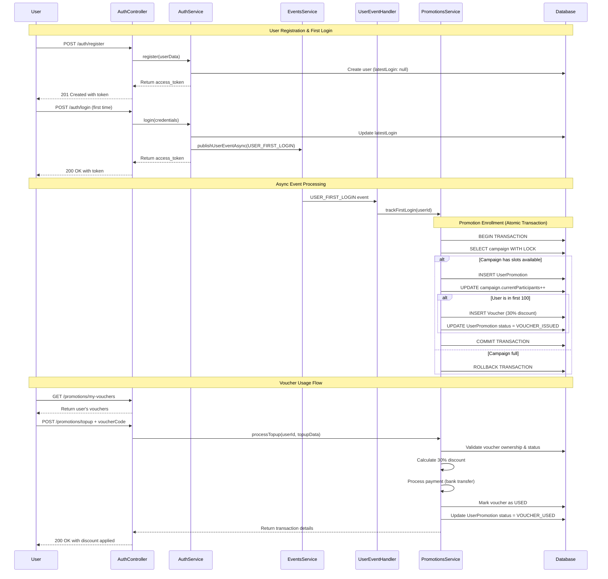

# First Login Campaign Promotion Flow

This document describes the complete flow of the first login campaign promotion system in the Cake System.

## Overview

The promotion system automatically rewards the first 100 users who login after registration with a 30% discount voucher for mobile phone top-up transactions via bank transfer.

## Architecture Components

### Core Entities

1. **PromotionCampaign** - Defines campaign parameters and tracks participation
2. **UserPromotion** - Links users to campaigns and tracks their participation status
3. **Voucher** - Discount vouchers issued to eligible users
4. **User** - Extended with `latestLogin` tracking for first login detection

### Key Services

- **AuthService** - Handles user registration and login, emits first login events
- **PromotionsService** - Core business logic for campaign management and voucher processing
- **EventsService** - Manages asynchronous event processing
- **UserEventHandler** - Processes first login events for promotion enrollment

## Complete Flow Diagram



## Detailed Flow Steps

### 1. Campaign Setup

**Admin creates a campaign:**
```http
POST /promotions/campaigns
{
  "name": "First Login Discount Campaign",
  "type": "first_login_discount",
  "startDate": "2024-01-01T00:00:00Z",
  "endDate": "2024-12-31T23:59:59Z",
  "maxParticipants": 100,
  "discountPercentage": 30,
  "minTopupAmount": 10,
  "voucherValidityDays": 30
}
```

### 2. User Registration

**User registers for an account:**
```http
POST /auth/register
{
  "fullname": "John Doe",
  "email": "john@example.com",
  "username": "johndoe",
  "phone": "+1-555-0123",
  "password": "securePassword123",
  "birthday": "1990-01-01"
}
```

**Response:**
```json
{
  "access_token": "eyJhbGciOiJIUzI1NiIs...",
  "user": {
    "id": "1",
    "fullname": "John Doe",
    "email": "john@example.com",
    "username": "johndoe",
    "phone": "+1-555-0123",
    "birthday": "1990-01-01T00:00:00.000Z",
    "latestLogin": null
  }
}
```

### 3. First Login Event

**User performs first login:**
```http
POST /auth/login
{
  "account": "johndoe",
  "password": "securePassword123"
}
```

**Internal Process:**
1. `AuthService.login()` detects `latestLogin === null`
2. Updates `latestLogin` to current timestamp
3. Emits `USER_FIRST_LOGIN` event via EventsService
4. Returns JWT token to user

### 4. Promotion Enrollment (Asynchronous)

**Event Handler Processing:**
```typescript
@OnEvent(EventJobs.USER_FIRST_LOGIN)
async handleUserFirstLogin(event: UserFirstLoginEvent) {
  const result = await this.promotionsService.trackFirstLogin(event.userId);
  // Logs enrollment success/failure
}
```

**Atomic Transaction in PromotionsService:**
```typescript
async trackFirstLogin(userId: string) {
  const queryRunner = this.dataSource.createQueryRunner();
  await queryRunner.startTransaction();
  
  try {
    // 1. Lock campaign to prevent race conditions
    const campaign = await queryRunner.manager.findOne(PromotionCampaign, {
      where: { status: 'ACTIVE' },
      lock: { mode: 'pessimistic_write' }
    });
    
    // 2. Check if slots available
    if (campaign.currentParticipants >= campaign.maxParticipants) {
      await queryRunner.rollbackTransaction();
      return { eligible: false, message: 'Campaign is full' };
    }
    
    // 3. Create user promotion record
    const participationOrder = campaign.currentParticipants + 1;
    const userPromotion = await queryRunner.manager.save(UserPromotion, {
      userId,
      campaignId: campaign.id,
      participationOrder,
      status: 'ELIGIBLE',
      firstLoginAt: new Date()
    });
    
    // 4. Update campaign participant count
    await queryRunner.manager.update(PromotionCampaign, campaign.id, {
      currentParticipants: participationOrder,
      status: participationOrder >= 100 ? 'FULL' : 'ACTIVE'
    });
    
    // 5. Issue voucher if in first 100
    if (participationOrder <= 100) {
      await this.issueVoucherForUser(queryRunner.manager, userPromotion, campaign);
    }
    
    await queryRunner.commitTransaction();
    return {
      eligible: true,
      participationOrder,
      message: `You're participant #${participationOrder}`
    };
  } catch (error) {
    await queryRunner.rollbackTransaction();
    throw error;
  }
}
```

### 5. Voucher Issuance

**For users #1-100:**
```typescript
async issueVoucherForUser(manager, userPromotion, campaign) {
  const voucherCode = `CAKE-${uuidv4().substring(0, 8).toUpperCase()}`;
  const expiresAt = new Date();
  expiresAt.setDate(expiresAt.getDate() + campaign.voucherValidityDays);
  
  const voucher = await manager.save(Voucher, {
    code: voucherCode,
    userPromotionId: userPromotion.id,
    type: 'MOBILE_TOPUP_DISCOUNT',
    status: 'ACTIVE',
    discountPercentage: 30,
    minTopupAmount: campaign.minTopupAmount,
    maxDiscountAmount: campaign.maxDiscountAmount,
    issuedAt: new Date(),
    expiresAt
  });
  
  // Update user promotion status
  await manager.update(UserPromotion, userPromotion.id, {
    status: 'VOUCHER_ISSUED',
    voucherIssuedAt: new Date()
  });
}
```

### 6. User Checks Vouchers

**Get user's vouchers:**
```http
GET /promotions/my-vouchers
Authorization: Bearer <jwt_token>
```

**Response:**
```json
[
  {
    "id": "1",
    "code": "CAKE-A1B2C3D4",
    "type": "mobile_topup_discount",
    "status": "active",
    "discountPercentage": 30,
    "minTopupAmount": 10,
    "maxDiscountAmount": 50,
    "issuedAt": "2024-01-15T10:00:00Z",
    "expiresAt": "2024-02-14T10:00:00Z",
    "isValid": true,
    "isExpired": false
  }
]
```

### 7. Mobile Top-up with Voucher

**Process top-up with discount:**
```http
POST /promotions/topup
Authorization: Bearer <jwt_token>
{
  "phoneNumber": "+1-555-0123",
  "amount": 100,
  "voucherCode": "CAKE-A1B2C3D4",
  "paymentMethod": "bank_transfer"
}
```

**Validation & Processing:**
```typescript
async processTopup(userId: string, topupRequest: TopupRequestDto) {
  // 1. Validate voucher
  const voucher = await this.voucherRepository.findOne({
    where: { code: topupRequest.voucherCode },
    relations: ['userPromotion']
  });
  
  // 2. Security checks
  if (voucher.userPromotion.userId !== userId) {
    throw new BadRequestException('Voucher does not belong to this user');
  }
  
  if (!voucher.isValid()) {
    throw new BadRequestException('Voucher is expired or already used');
  }
  
  if (topupRequest.amount < voucher.minTopupAmount) {
    throw new BadRequestException('Amount below minimum requirement');
  }
  
  // 3. Calculate discount (30% with max cap)
  const discountAmount = voucher.calculateDiscount(topupRequest.amount);
  const finalAmount = topupRequest.amount - discountAmount;
  
  // 4. Process payment
  const transactionId = this.generateTransactionId();
  const paymentSuccess = await this.processPayment(
    topupRequest.phoneNumber,
    finalAmount,
    transactionId
  );
  
  if (!paymentSuccess) {
    throw new BadRequestException('Payment processing failed');
  }
  
  // 5. Mark voucher as used
  voucher.status = 'USED';
  voucher.usedAt = new Date();
  voucher.usedAmount = topupRequest.amount;
  voucher.discountAmount = discountAmount;
  voucher.transactionReference = transactionId;
  await this.voucherRepository.save(voucher);
  
  // 6. Update user promotion status
  await this.userPromotionRepository.update(voucher.userPromotionId, {
    status: 'VOUCHER_USED',
    voucherUsedAt: new Date()
  });
  
  return {
    success: true,
    transactionId,
    originalAmount: topupRequest.amount,
    discountAmount,
    finalAmount,
    phoneNumber: topupRequest.phoneNumber,
    voucherCode: topupRequest.voucherCode,
    message: `Top-up successful! You saved ${discountAmount} with your voucher.`
  };
}
```

**Response:**
```json
{
  "success": true,
  "transactionId": "TXN-1756069214522-5OXF2S",
  "originalAmount": 100,
  "discountAmount": 30,
  "finalAmount": 70,
  "phoneNumber": "+1-555-0123",
  "voucherCode": "CAKE-A1B2C3D4",
  "message": "Top-up successful! You saved 30 with your voucher."
}
```

## State Transitions

### Campaign States
```
INACTIVE → ACTIVE → (FULL | EXPIRED)
```

### User Promotion States
```
ELIGIBLE → VOUCHER_ISSUED → VOUCHER_USED
```

### Voucher States
```
ACTIVE → (USED | EXPIRED | CANCELLED)
```

## Race Condition Prevention

### Atomic Enrollment
- **Pessimistic Locking**: Campaign records are locked during participant counting
- **Database Transactions**: All enrollment operations are atomic
- **Unique Constraints**: Prevent duplicate user participation

### Concurrent Safety
```typescript
// Example: 50 users login simultaneously
// Only first 100 get vouchers, rest get participation tracking
const queryRunner = this.dataSource.createQueryRunner();
await queryRunner.startTransaction();

try {
  const campaign = await queryRunner.manager.findOne(PromotionCampaign, {
    where: { id: campaignId },
    lock: { mode: 'pessimistic_write' } // Blocks other transactions
  });
  
  // Atomic increment prevents race conditions
  const participationOrder = campaign.currentParticipants + 1;
  
  // Rest of enrollment logic...
} catch (error) {
  await queryRunner.rollbackTransaction();
  throw error;
}
```

## API Endpoints Summary

### Campaign Management (Admin)
- `POST /promotions/campaigns` - Create campaign
- `GET /promotions/campaigns` - List active campaigns
- `GET /promotions/campaigns/:id` - Get campaign details

### User Endpoints
- `POST /auth/register` - User registration
- `POST /auth/login` - User login (triggers first login event)
- `GET /promotions/eligibility` - Check promotion eligibility
- `GET /promotions/my-promotions` - User's promotion history
- `GET /promotions/my-vouchers` - User's vouchers
- `POST /promotions/topup` - Mobile top-up with voucher

### Utility Endpoints
- `GET /promotions/vouchers/:code/validate` - Validate voucher code
- `POST /promotions/track-first-login` - Manual first login tracking

## Error Handling

### Common Error Scenarios
1. **Campaign Full**: `{ eligible: false, message: "Campaign is full" }`
2. **Already Participated**: `{ eligible: false, message: "User has already participated" }`
3. **Invalid Voucher**: `404 Not Found` or `400 Bad Request`
4. **Expired Voucher**: `400 Bad Request - "Voucher is expired or already used"`
5. **Insufficient Amount**: `400 Bad Request - "Minimum top-up amount is X"`
6. **Payment Failed**: `400 Bad Request - "Payment processing failed"`

## Monitoring & Logging

### Key Metrics to Track
- Campaign participation rates
- Voucher issuance success rate
- Voucher usage rate
- Payment success rate
- Race condition occurrences

### Log Events
- First login events processed
- Promotion enrollments (success/failure)
- Voucher issuances
- Voucher usage
- Payment transactions
- Error conditions

## Testing

The system includes comprehensive e2e tests covering:
- ✅ Campaign creation and management
- ✅ User registration and first login flow
- ✅ Promotion enrollment and voucher issuance
- ✅ Voucher validation and usage
- ✅ Mobile top-up with discount application
- ✅ Edge cases and error conditions
- ✅ Concurrent user registration handling
- ✅ Race condition prevention

Run tests with:
```bash
npm run test:e2e:campaign        # Campaign-specific tests
npm run test:e2e:campaign:full   # Full test with environment setup
npm run test:e2e                 # All e2e tests
```

## Security Considerations

1. **JWT Authentication**: All user endpoints require valid JWT tokens
2. **Voucher Ownership**: Users can only use their own vouchers
3. **Input Validation**: All inputs validated with class-validator
4. **SQL Injection Prevention**: TypeORM provides protection
5. **Rate Limiting**: Configured at application level
6. **Audit Trail**: All voucher usage tracked with transaction references

## Performance Optimizations

1. **Database Indexing**: Strategic indexes on frequently queried fields
2. **Connection Pooling**: Configured for high concurrency
3. **Async Event Processing**: Non-blocking promotion enrollment
4. **Caching**: Redis integration for session management
5. **Query Optimization**: Efficient database queries with proper joins

This promotion flow ensures a robust, scalable, and secure implementation of the first login campaign requirements.
